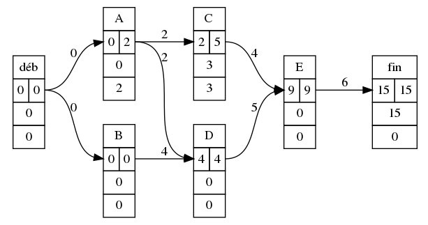

grapheMPM
=========
:page Github: https://github.com/TeddyBoomer/grapheMPM
:Téléchargement: https://github.com/TeddyBoomer/grapheMPM/releases

Un objet python pour implémenter la méthode des potentiels Métra MPM
d'ordonnancement.
La classe `graphMPM` comporte:

* le dictionnaire des `successeurs`
* celui des `prédecesseurs`,
* celui des `niveaux` (à créer avec la méthode `setlevel`),
* la matrice d'adjacence `mat_adj`
* l'objet `gv` qui est sa traduction GraphViz (à créer et recharger par la méthode `makeGraphviz`)

On y a implémenté les méthodes pour les dates au plus tôt, au plus tard.
 
dépendances:
============

modules python: Graphviz, lxml
logiciel Graphviz

Illustration de principe:
=========================
On créée un objet `GraphMPM` à l'aide d'un dictionnaire des successeurs et un dictionnaire des pondérations.

```python
#dico des successeurs
D = {"déb":"AB", "A": "CD", "B":"D", "C":"E", "D": "E", "E":["fin"], "fin": ""}
#dico des pondérations
L = {"A":2, "B":4, "C":4, "D":5, "E":6, "déb":0, "fin":0}
G = GraphMPM(D,L)
G.setlevel()                                                            
G.earliestdate()
G.makeGraphviz()
G.gv.render("ex1-ed")
```


```python
G.latestdate()
G.makeGraphviz()
G.gv.render("ex1-full")
```


La méthode `setlevel` applique l'algorithme de recherche des niveaux à partir
de l'observation des colonnes nulles de la matrice d'adjacence `mat_adj`.

Les méthodes `earliestdate, latestdate` mettent à jour les dates des nœuds et
doivent être appliquées dans le bon ordre.

Installation
============

Module en Python3. Il vous est conseillé d'utiliser une
version de Python >=3.4. En effet, à partir de là, l'installateur pip
standardise l'installation des modules (et utilise le plus récent format
d'archive **wheel**)

Il s'agit donc d'installer d'abord les dépendances puis l'archive wheel .whl

Pour windows::

```
py -3 -m pip install graphviz lxml \chemin\vers\graphMPM-xxx-py3-none-any.whl
```

Pour linux::

```
sudo pip3 install graphviz lxml /chemin/vers/graphMPM-xxx-py3-none-any.whl
```

Documentation
=============

La documentation se trouve dans le dossier *data* du module (à
chercher dans le dossier de votre python par ex. C:\Python34 ou
/usr/local/lib/python3.4/dist-packages)
