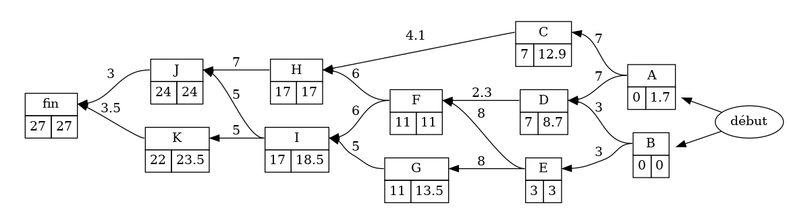

grapheMPM
=========

* [page Github](https://github.com/TeddyBoomer/grapheMPM)

* [Téléchargement (page des releases)](https://github.com/TeddyBoomer/grapheMPM/releases)

* **commandes d'installation**: voir tout en bas de cette page.

Des objets python pour implémenter la méthode des potentiels Métra MPM
d'ordonnancement.

## La classe `GrapheSimple` comporte:

* le dictionnaire `GrapheSimple.successeurs`
* le dictionnaire `GrapheSimple.predecesseurs`,
* matrices liées au graphe de type `numpy.matrix`:
  - la matrice d'adjacence `GrapheSimple.mat_adj`,
  - la matrice de fermeture transitive `GrapheSimple.mat_ferm_transitive`,
  - la liste des puissances de la matrice d'adjacence `GrapheSimple.Matrices`. La 1ere est celle de la matrice de fermeture transitive.
  - la liste de leur export latex `GrapheSimple.Matrices_latex`
* export latex du tableau des prédecesseurs `GrapheSimple.tab_latex_pred`
* export latex du tableau des successeurs `GrapheSimple.tab_latex_succ`
* le dictionnaire `num_sommets` pour lier leur nom à leur emplacement dans la matrice d'adjacence,
* l'objet `gv` qui est sa traduction Graphviz (à créer et recharger par la méthode `makeGraphviz`)
(on peut générer le graphe normal ou complété avec la fermeture transitive)

## La classe `GrapheMPM` hérite des attributs et méthodes de `GrapheSimple` avec en plus:

* le dictionnaire des `niveaux`,
* les méthodes `earliestdate`, `latestdate` pour remplir les dates
* une méthode `setlevel` pour calculer les niveaux des sommets (utilisée en interne dans la classe)

deux fonctions techniques sont présentes dans le module:

* fonction `mat2tex` pour afficher l'export LaTeX d'une matrice (objet pmatrix)
* fonction `tab_latex` pour convertir les dictionnaires des prédecesseurs et successeurs en latex.
 
dépendances:
============

* modules python: Graphviz, lxml, numpy, pandas — installés automatiquement
* logiciel [Graphviz](https://graphviz.org/) — à installer vous-même.

Illustration de principe:
=========================

objet GrapheMPM
----------------
**Nouveau (v>=0.6)**: puissances de la matrice d'adjacence (en numpy et en latex) disponibles
  par défaut, les marges ne sont plus affichées.

**Nouveau (v>=0.5.3)**: un paramètre booléen `marges` (`True`/`False`) pour indiquer d'afficher les cases des marges.

**Nouveau (v>=0.5)**: plus besoin de renseigner des sommets 'début' et 'fin'

**Nouveau (v>=0.4)**: Les poids peuvent être des décimaux.

On créée un objet `GrapheMPM` à l'aide d'un dictionnaire des successeurs ou des prédecesseurs et un dictionnaire des pondérations.

```python
from grapheMPM import GrapheMPM

# dico des prédecesseurs
p = {"A": "", "B": "", "C": "A", "D": "AB", "E":"B",
     "F":"DE", "G": "E", "H":"CF", "I":"FG", "J": "HI", "K": "I"}
# dico des pondérations
w = {"A": 7, "B": 3, "C": 4.1, "D": 2.3, "E": 8,
     "F": 6, "G": 5, "H": 7, "I": 5, "J": 3, "K": 3.5}

G = GrapheMPM(pred=p, pond=w, marges=False) # par défaut marges=False
G.earliestdate()
G.makeGraphviz()
G.gv.render("ex-ed-nomarge")
G.gv.format("svg")
G.gv.render("ex-ed-nomarge")
```
L'avant dernière ligne permet de changer le format d'image à svg plutôt que png.


```python
G.latestdate()
G.makeGraphviz()
G.gv.render("ex-full-nomarge")
```


observation du paramètre `presentation` (à 1 par défaut) permet de régler la
répartition des marges (l'une sur l'autre ou côte à côte). Voici le graphe
complet avec `presentation=1` puis `presentation=2`:


```python
G = GrapheMPM(pred=p, pond=w, marges=True, presentation=1)
# […]
```


```python
G = GrapheMPM(pred=p, pond=w, marges=True, presentation=2)
# […]
```


**Attention**: depuis la version v0.3, on initialise l'objet avec des éléments
nommés:

* au choix `pred` ou `succ` dictionnaire des prédécesseurs (resp. des successeurs)
* `pond` dictionnaire des pondérations.

Les méthodes `earliestdate, latestdate` mettent à jour les dates des nœuds et
doivent être appliquées dans le bon ordre.

**expérimental**: le paramètre `show_level` (`True/False`) est disponible pour
l'initialisation, mais ça ne fait pas forcément un bon rendu, les sommets étant
mélangés dans les niveaux; c'est graphviz qui les organise.

**Astuce d'orientation**: pour les plus téméraires, vous pouvez choisir
l'orientation du graphe au moment du rendu. Il suffit de préciser la valeur de
l'attribut `rankdir` pour `.gv` qui vaut `LR` (left-right) par défaut:

```
G.gv.attr(rankdir="TB") # top-bottom
G.gv.attr(rankdir="BT") # bottom-top
G.gv.attr(rankdir="RL") # right-left
G.gv.render("image")
```
<table>
 <tbody><tr>
  <td></td>
  <td></td>
  <td></td>
</tr></tbody>
</table>

objet `GrapheSimple`
---------------------

C'est une classe plus simple à charger simplement avec un dictionnaire des
prédecesseurs ou des successeurs.

On peut générer le graphe simple, ou sa version complète avec fermeture transitive.

```python
from grapheMPM import GrapheSimple, mat2tex

# dico des prédecesseurs
# dico des prédecesseurs
p = {"A": "", "B": "", "C": "A", "D": "AB", "E":"B",
     "F":"DE", "G": "E", "H":"CF", "I":"FG", "J": "HI", "K": "I"}

G = GrapheSimple(pred=p)
G.makeGraphviz()
G.gv.render("ex-simple")

G.makeGraphviz(fermeture=True)
G.gv.render("ex-simple-full")

print(mat2tex(G.mat_adj))
print(G.Matrices_latex[1]) # équivalent, la num 0 est celle de fermeture transitive

print(G.tab_latex_pred)
print(G.tab_latex_succ)
```

<table><tbody><tr>
<td>

```latex
\begin{pmatrix}
  0 & 0 & 1 & 1 & 0 & 0 & 0 & 0 & 0 & 0 & 0\\
  0 & 0 & 0 & 1 & 1 & 0 & 0 & 0 & 0 & 0 & 0\\
  0 & 0 & 0 & 0 & 0 & 0 & 0 & 1 & 0 & 0 & 0\\
  0 & 0 & 0 & 0 & 0 & 1 & 0 & 0 & 0 & 0 & 0\\
  0 & 0 & 0 & 0 & 0 & 1 & 1 & 0 & 0 & 0 & 0\\
  0 & 0 & 0 & 0 & 0 & 0 & 0 & 1 & 1 & 0 & 0\\
  0 & 0 & 0 & 0 & 0 & 0 & 0 & 0 & 1 & 0 & 0\\
  0 & 0 & 0 & 0 & 0 & 0 & 0 & 0 & 0 & 1 & 0\\
  0 & 0 & 0 & 0 & 0 & 0 & 0 & 0 & 0 & 1 & 1\\
  0 & 0 & 0 & 0 & 0 & 0 & 0 & 0 & 0 & 0 & 0\\
  0 & 0 & 0 & 0 & 0 & 0 & 0 & 0 & 0 & 0 & 0\\
\end{pmatrix}
```

</td>
<td>

```latex
\begin{tabular}{|c|c|}
\toprule
Sommet & Prédécesseur(s) \\
\midrule
     A &                 \\
     B &                 \\
     C &               A \\
     D &              AB \\
     E &               B \\
     F &              DE \\
     G &               E \\
     H &              CF \\
     I &              FG \\
     J &              HI \\
     K &               I \\
\bottomrule
\end{tabular}
```

</td>
<td>

```latex
\begin{tabular}{|c|c|}
\toprule
Sommet & Successeur(s) \\
\midrule
     A &            CD \\
     B &            DE \\
     C &             H \\
     D &             F \\
     E &            FG \\
     F &            HI \\
     G &             I \\
     H &             J \\
     I &            JK \\
     J &               \\
     K &               \\
\bottomrule
\end{tabular}
```
</td></tr></tbody></table>

**Astuce**: quand on oublie le nom des attributs disponibles, on peut lister le
contenu de l'objet en tapant `dir(G)`.


Vous pourrez observer que graphviz ne met pas forcément les sommets sur le
niveau attendu si on ne le force pas (sommet C):

 

Installation ou mise à jour
===========================

Module en Python3. Il vous est conseillé d'utiliser une
version de Python >=3.4. En effet, à partir de là, l'installateur pip
standardise l'installation des modules (et utilise le plus récent format
d'archive **wheel**)

L'installateur pip veillera à installer les dépendances.

Pour windows:

```
py -3 -m pip install \chemin\vers\grapheMPM-xxx-py3-none-any.whl
```

Pour linux:

```
pip3 install  /chemin/vers/grapheMPM-xxx-py3-none-any.whl
```

Pour mettre à jour quand on a déjà le module, on peut ajouter un paramètre `-U`
ou `--upgrade` pour accepter la version la plus récente. exemple linux:

```
pip3 install -U  /chemin/vers/grapheMPM-xxx-py3-none-any.whl
```

