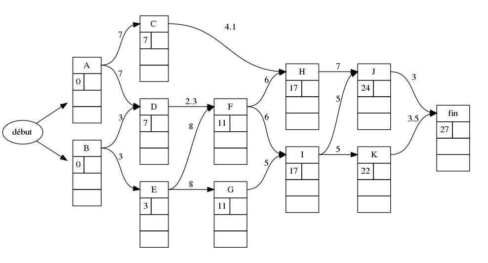

grapheMPM
=========

* [page Github](https://github.com/TeddyBoomer/grapheMPM)

* [Téléchargement](https://github.com/TeddyBoomer/grapheMPM/releases)

* **commandes d'installation**: voir tout en bas de cette page.

Des objets python pour implémenter la méthode des potentiels Métra MPM
d'ordonnancement.

La classe `GrapheSimple` comporte:

* le dictionnaire des `successeurs`
* celui des `predecesseurs`,
* la matrice d'adjacence `mat_adj`,
* la matrice de fermeture transitive `mat_ferm_transitive`,
* une méthode `mat2tex` pour afficher l'export LaTeX d'une matrice (objet pmatrix)
* le dictionnaire `num_sommets` pour lier leur nom à leur emplacement dans la matrice d'adjacence,
* l'objet `gv` qui est sa traduction Graphviz (à créer et recharger par la méthode `makeGraphviz`)
(on peut générer le graphe normal ou complété avec la fermeture transitive)

La classe `GrapheMPM` hérite des attributs et méthodes de `GrapheSimple` avec en plus:

* le dictionnaire des `niveaux`,
* les méthodes `earliestdate`, `latestdate` pour remplir les dates
* une méthode `setlevel` pour calculer les niveaux des sommets (utilisée en interne dans la classe)
 
dépendances:
============

* modules python: Graphviz, lxml, numpy — installés automatiquement
* logiciel [Graphviz](https://graphviz.org/) — à installer vous-même.

Illustration de principe:
=========================

graphe GrapheMPM
----------------
**Nouveau (v>=0.5.3)**: un paramètre booléen `marges` (`True`/`False`) pour indiquer d'afficher les cases des marges.

**Nouveau (v>=0.5)**: plus besoin de renseigner des sommets 'début' et 'fin'

**Nouveau (v>=0.4)**: Les poids peuvent être des décimaux.

On créée un objet `GrapheMPM` à l'aide d'un dictionnaire des successeurs ou des prédecesseurs et un dictionnaire des pondérations.

```python
from grapheMPM import GrapheMPM

# dico des prédecesseurs
p = {"A": "", "B": "", "C": "A", "D": "AB", "E":"B",
     "F":"DE", "G": "E", "H":"CF", "I":"FG", "J": "HI", "K": "I"}
# dico des pondérations
w = {"A": 7, "B": 3, "C": 4.1, "D": 2.3, "E": 8,
     "F": 6, "G": 5, "H": 7, "I": 5, "J": 3, "K": 3.5}

G = GrapheMPM(pred=p, pond=w)
G.earliestdate()
G.makeGraphviz()
G.gv.render("ex-ed")
G.gv.format("svg")
G.gv.render("ex-ed")
```
L'avant dernière ligne permet de changer le format d'image à svg plutôt que png.



```python
G.latestdate()
G.makeGraphviz()
G.gv.render("ex-full")
```


observation du paramètre `presentation` (à 1 par défaut) permet de régler la
répartition des marges (l'une sur l'autre ou côte à côte). Voici le graphe
complet avec `presentation=2`:

```python
G = GrapheMPM(pred=p, pond=w, presentation=2)
# […]
```


observation du paramètre booléen `marges` (à `True` par défaut)
```python
G = GrapheMPM(pred=p, pond=w, marges=False)
# […]
```


**Attention**: depuis la version v0.3, on initialise l'objet avec des éléments
nommés:

* au choix `pred` ou `succ` dictionnaire des prédécesseurs (resp. des successeurs)
* `pond` dictionnaire des pondérations.

**Nouveau (version >=0.5.1)**: La méthode `setlevel` applique l'algorithme de
recherche des niveaux à partir de l'observation des colonnes nulles de la
matrice d'adjacence `mat_adj`. Elle est directement utilisée dans
l'initialisation d'un grapheMPM; vous n'avez plus besoin de l'appeler.

Les méthodes `earliestdate, latestdate` mettent à jour les dates des nœuds et
doivent être appliquées dans le bon ordre.

**expérimental**: le paramètre `show_level` (`True/False`) est disponible pour
l'initialisation, mais ça ne fait pas forcément un bon rendu, les sommets étant
mélangés dans les niveaux; c'est graphviz qui les organise.

graphe `GrapheSimple`
---------------------

C'est une classe plus simple à charger simplement avec un dictionnaire des
prédecesseurs ou des successeurs.

L'objet construit les deux dictionnaires, la matrice d'adjacence et celle de
fermeture transitive.

* On peut exporter les matrices au format LaTeX (pmatrix)
* On peut générer le graphe simple, ou sa version complète avec fermeture transitive.

```python
from grapheMPM import GrapheSimple

# dico des prédecesseurs
# dico des prédecesseurs
p = {"A": "", "B": "", "C": "A", "D": "AB", "E":"B",
     "F":"DE", "G": "E", "H":"CF", "I":"FG", "J": "HI", "K": "I"}

G = GrapheSimple(pred=p)
G.makeGraphviz()
G.gv.render("ex-simple")

G.makeGraphviz(fermeture=True)
G.gv.render("ex-simple-full")

print(G.mat2tex(G.mat_adj))
```

```latex
\begin{pmatrix}
  0 & 0 & 1 & 1 & 0 & 0 & 0 & 0 & 0 & 0 & 0\\
  0 & 0 & 0 & 1 & 1 & 0 & 0 & 0 & 0 & 0 & 0\\
  0 & 0 & 0 & 0 & 0 & 0 & 0 & 1 & 0 & 0 & 0\\
  0 & 0 & 0 & 0 & 0 & 1 & 0 & 0 & 0 & 0 & 0\\
  0 & 0 & 0 & 0 & 0 & 1 & 1 & 0 & 0 & 0 & 0\\
  0 & 0 & 0 & 0 & 0 & 0 & 0 & 1 & 1 & 0 & 0\\
  0 & 0 & 0 & 0 & 0 & 0 & 0 & 0 & 1 & 0 & 0\\
  0 & 0 & 0 & 0 & 0 & 0 & 0 & 0 & 0 & 1 & 0\\
  0 & 0 & 0 & 0 & 0 & 0 & 0 & 0 & 0 & 1 & 1\\
  0 & 0 & 0 & 0 & 0 & 0 & 0 & 0 & 0 & 0 & 0\\
  0 & 0 & 0 & 0 & 0 & 0 & 0 & 0 & 0 & 0 & 0\\
\end{pmatrix}
```

Vous pourrez observer que graphviz ne met pas forcément les sommets sur le niveau 
attendu si on ne le force pas (sommet C):

 

Installation ou mise à jour
===========================

Module en Python3. Il vous est conseillé d'utiliser une
version de Python >=3.4. En effet, à partir de là, l'installateur pip
standardise l'installation des modules (et utilise le plus récent format
d'archive **wheel**)

L'installateur pip veillera à installer les dépendances.

Pour windows:

```
py -3 -m pip install \chemin\vers\grapheMPM-xxx-py3-none-any.whl
```

Pour linux:

```
pip3 install  /chemin/vers/grapheMPM-xxx-py3-none-any.whl
```

Pour mettre à jour quand on a déjà le module, on peut ajouter un paramètre `-U`
ou `--upgrade` pour accepter la version la plus récente. exemple linux:

```
pip3 install -U  /chemin/vers/grapheMPM-xxx-py3-none-any.whl
```

